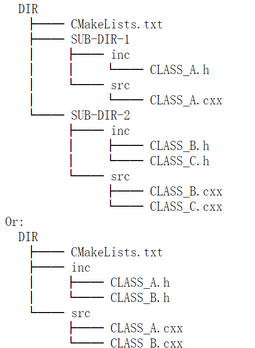

## Adding a new class
{: .no_toc }

### Table of contents
{: .no_toc .text-delta }

1. TOC
{:toc}

---

REST auto detectes source files in its directories. During the making, Cmake makes use of all the .h and .cxx
files in the sub inc/src directories of each working directory. In concrete, the regular form of 
directory order is:

Cmake first targets on a .cxx file. It regards the file name as the class name. Then it searches the .h file
of this class. If found, it calls CINT to make a wrapper for the class with this .h file. ROOT CINT genertes
a new .cxx file for the .h file, containing some streamer methods and reflection methods which overwrites 
those in TObject class. Each .h file can only contain one TObject inherited class whose name must be the 
same as the file name. Then Cmake includes that .h file and complies the two .cxx files calling gcc. This 
work is done for all .cxx files, after which CMake generates a library with the name of the directory.

As for the user, after adding a new class, he just needs to rerun the command `cmake PATH [options]` followed 
by `make install` in the build directory. Alternativelly he can switch to ./script directory and call
`python scriptsInterface.py`.

To add a new process, we suggest copying the header file and the source file of our template dummy process. 
They are in the directory ./packages/userRESTLibrary, named "mySignalProcess". First rename the files and 
replace all the instance of "mySignalProcess" into your process name. Then add your class member and implement
your InitFromConfigFile() method. It will be convenient to use GetParameter() and StringToDouble() methods 
to set configurations from rml file. Then define your input and output event type, by using code like:
`fInputEvent = new TRestxxxEvent();`. Finally implement your ProcessEvent() method which is for the main 
analysis loop. A new process is ready!

Adding new event class or metadata class shall be similar.

